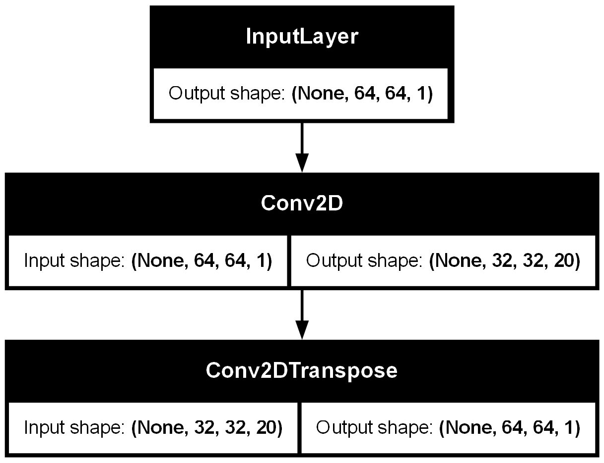

# Deep-Learning-for-Digital-Hologram-Reconstruction-and-Simulation
#  Introduction
The intersection of computational imaging and deep learning has opened transformative pathways for reconstructing complex physical phenomena from raw data. This project presents a comprehensive pipeline for holographic image reconstruction using convolutional neural networks (CNNs), Fourier optics, and physics-based simulation. By integrating classical wave propagation models with modern machine learning architectures, the system offers a robust framework for learning and visualizing object field relationships in holography.
At its core, the project addresses the challenge of reconstructing object images from holographic labels grayscale intensity patterns that encode phase and amplitude information. A custom CNN architecture is trained to learn this mapping, leveraging convolutional and transposed convolutional layers to extract and reconstruct spatial features. The training process is visualized through animated loss curves, while model outputs are evaluated using local thresholding and comparative image plots.
Beyond the neural network, the project incorporates a physics-based simulation of Fresnel diffraction using Fourier transforms. This module generates synthetic holograms from moving objects, enabling dynamic visualization of wavefront propagation and interference patterns. The simulation is animated to illustrate how object motion affects hologram formation, providing an intuitive bridge between physical optics and data-driven learning.

# Key contributions of this work include:
• 	A custom CNN for hologram to object reconstruction trained on real grayscale image pairs.
• 	Integration of Fresnel diffraction simulation using FFT based propagation kernels.
• 	Visualization of training dynamics through animated loss curves and output comparisons.
• 	Generation of synthetic holograms from moving objects to validate physical modeling.
• 	Modular project structure supporting reproducibility, scalability, and future experimentation.
This hybrid approach, combining physics based modeling with deep learning demonstrates the power of interdisciplinary design in solving inverse problems. It lays the groundwork for future research in computational holography, optical neural networks, and physics informed machine learning, offering a compelling platform for both academic inquiry and practical deployment.

# Abstract
This project integrates deep convolutional neural networks with Fourier optical simulations to reconstruct and visualize holographic images. First, paired hologram–object datasets are preprocessed and fed into a lightweight CNN that learns to map hologram intensities back to underlying object structures. The trained model is evaluated using local adaptive thresholding, producing binary masks that recover hidden features. In parallel, analytic simulations of Fresnel diffraction illustrate field propagation, phase encoding at the hologram plane, and dynamic moving-object hologram animations. An animated plot of CNN training loss complements the optical animations, offering insight into model convergence. By bridging deep learning and classical Fourier optics, this repository provides a comprehensive platform for advancing computational imaging and holographic reconstruction research.

 **how to run:** excute the script "Deep Learning for Digital Hologram Reonstuction and Simullation.ipynb. You can also use it as a guide to obtain the results of this project.
 
## Requirements

- Python 3.7 or higher  
- TensorFlow 2.x  
- PyTorch (optional, for data utilities)  
- NumPy  
- SciPy  
- Matplotlib  
- Pillow  
- scikit‐image  
- tqdm  

## Install dependencies:

pip install numpy scipy matplotlib pillow scikit-image tqdm tensorflow torch

# Concepts Illustrated
• 	Convolutional neural networks for image-to-image reconstruction
• 	Adaptive local thresholding for binary mask extraction
• 	Fresnel diffraction via Fourier-domain transfer functions
• 	Dynamic hologram simulation and GIF animation
• 	Visualization of deep learning training dynamics

# Research Relevance
This project demonstrates:
• 	Integration of machine learning with classical Fourier optics
• 	An end-to-end pipeline from data loading through model training to optical simulation
• 	Interactive and static visualizations for both neural and physical optics
• 	A foundation for further research in computational imaging and holographic reconstruction

# Author
Developed by Alhassan Kpahambang Fuseini.

# License
This project is licensed under the MIT License. Feel free to use, modify, and distribute with attribution.
